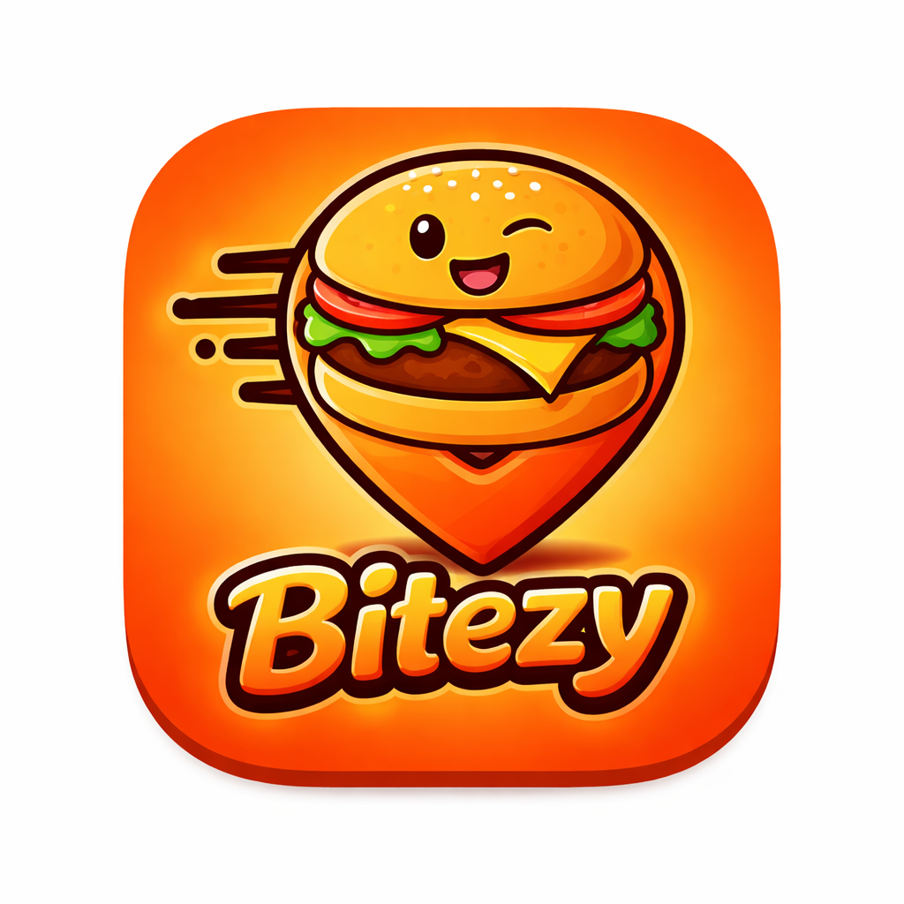

<div align="center">
  
  <h1>Bitezy</h1>
  <p>A modern, high-performance food delivery & discovery mobile application built with <b>React Native</b> and <b>Expo</b>.</p>
</div>

---

## 🚀 Overview

**Bitezy** is designed to provide a seamless food ordering experience. Users can browse categories, explore popular food items, manage their cart in real-time, and customize their delivery profiles. Leveraging the power of <b>Expo Router</b> and <b>React Context API</b>, Bitezy offers a smooth, reliable, and intuitive interface.

## ✨ Key Features

- 📱 **Modern Tab Navigation**: Intuitive access to Home, Cart, and Profile.
- 🍕 **Category Browsing**: Explore food items organized by cuisine or type with dedicated list views.
- 🛒 **Dynamic Cart System**: Real-time cart management using `CartContext` with add/remove functionality.
- 🔒 **Secure Authentication**: Built-in login screen with user session management via `AuthContext`.
- 📍 **Profile & Delivery**: Integrated profile management for user details and delivery addresses.
- 🎨 **Shared Design System**: Consistent UI using custom themed components (`ThemedView`, `ThemedText`).
- ✨ **Rich Animations**: Smooth transitions and haptic feedback for a premium feel.
- 🔔 **Toast Notifications**: Interactive user feedback using `react-native-toast-message`.

## 🛠 Tech Stack

- **Framework**: [React Native](https://reactnative.dev)
- **Runtime**: [Expo 54 SDK](https://expo.dev)
- **Navigation**: [Expo Router v3](https://docs.expo.dev/router/introduction) (File-based)
- **State Management**: [React Context API](https://react.dev/reference/react/createContext)
- **UI & Styling**:
  - Custom Theming System (`constants/theme.ts`)
  - [Reanimated](https://docs.swmansion.com/react-native-reanimated/) for animations
  - [Linear Gradient](https://docs.expo.dev/versions/latest/sdk/linear-gradient/) for sleek backgrounds
  - [Vector Icons](https://docs.expo.dev/guides/icons/) (@expo/vector-icons)
- **Persistence**: [Async Storage](https://docs.expo.dev/versions/latest/sdk/async-storage/)

## 📂 Project Structure

```bash
Bitezy/
├── app/                  # Main application routes (Expo Router)
│   ├── (auth)/           # Authentication screens (Login)
│   ├── (tabs)/           # Main bottom tabs (Home, Cart, Profile)
│   ├── food-list/        # Category-specific food listing
│   └── _layout.tsx       # Root layout configuration
├── components/           # Reusable UI components
│   ├── ui/               # Base UI elements
│   ├── CategoryCard.tsx  # Interactive category items
│   └── FoodItemCard.tsx  # Food display widgets
├── context/              # Global state (Cart, Auth)
├── constants/            # Application themes and constants
├── assets/               # Branding assets and images
└── data/                 # Mock data or API handlers
```

## 📦 Getting Started

### 1. Prerequisites
Ensure you have **Node.js** and **npm** installed on your machine.

### 2. Installation
Clone the repository and install the dependencies:
```bash
npm install
```

### 3. Run the App
Start the Expo development server:
```bash
npx expo start
```
Use the **Expo Go** app on your phone or an **Emulator** (Android/iOS) to view the application.

## 📜 Available Scripts

- `npm start` - Starts the Expo server.
- `npm run android` - Runs the app on an Android emulator.
- `npm run ios` - Runs the app on an iOS simulator.
- `npm run lint` - Checks for code styling issues.
- `npm run reset-project` - Clears the project structure.

---

<div align="center">
  <p>Made with ❤️ for food lovers.</p>
</div>

